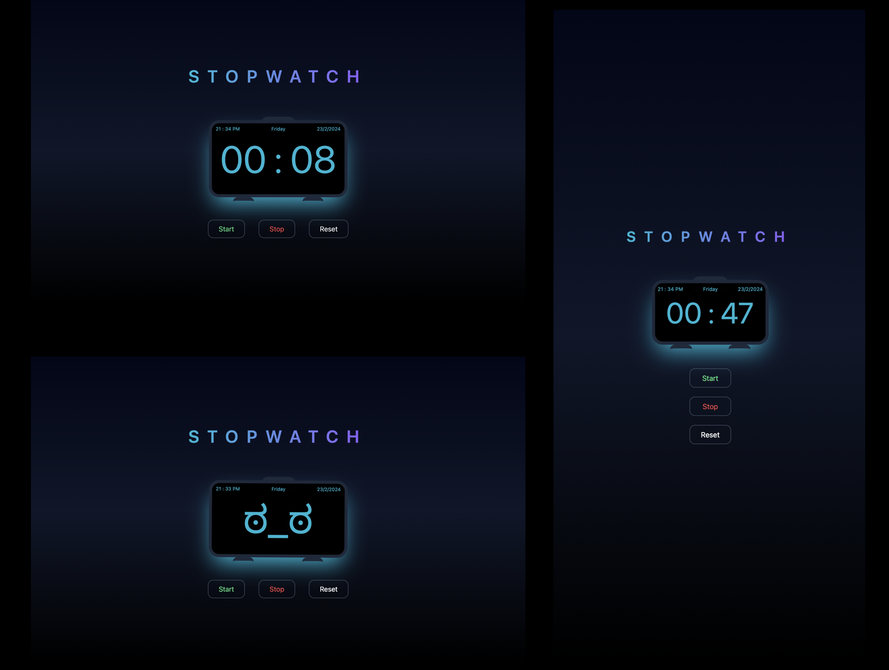

# **stopWatch**

## This project consist of realTime `clock` and `Stop_Watch`.

## Table of contents

- [Overview](#overview)
  - [The challenge](#the-challenge)
  - [Links](#links)
  - [Built with](#built-with)
  - [What I learned](#what-i-learned)
  - [Useful resources](#useful-resources)

## Overview

### The challenge

Users should be able to:

- Start, Stop and Reset the Timer
- will be able to view current `Date` and `Time`

### Screenshot

### Links

- Solution URL: [Github link](https://github.com/Rataash99/stopWatch)
- GitHub Pages URL: [check](https://rataash99.github.io/stopWatch/)

### Built with

- HTML, CSS, JavaScript
- Tailwind CSS
- [Styled Components](https://fontawesome.com) - For Styles

### What I learned?

- JS concepts
- TailWind CSS
- I get to know the overall working of Date API.

### Useful resources

- [Resource 1](https://www.fontawesome.com) - This helped me for choosing icons. I really liked this pattern and will use it going forward.
- [Resource 2](https://fonts.google.com) - This is an amazing website which helped me select whatever the font i've needed.
- [Resource 3](https://tailwindcss.com/docs/installation) - Amazing Documentation for Tailwind CSS, A must check out!

